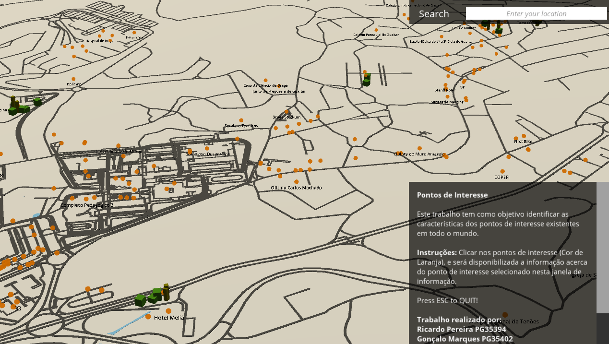
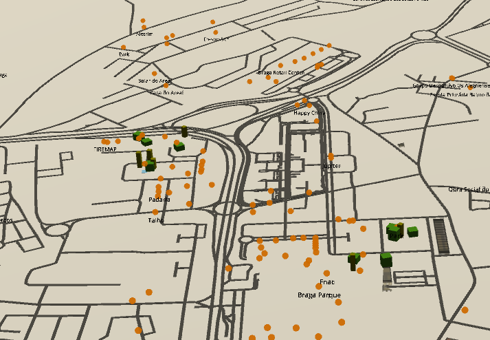

# Tecnologias e Aplicações
## Segmentação de estradas em imagens do Sentinel-2
#### Jorge Paiva pg35404
#### Ricardo Pereira pg35394
#### Gonçalo Marques pg35402
#### Pedro Barros pg35399
### Descrição do problema
O objetivo deste trabalho é obter, uma aplicação que seja capaz de pegar em dados dado pelo open street mapa e consigamos reconstruir a arquitetura evolvente na aplicação e que seja possível o utilizador mudar a localização e viajar pelo mapa 3d.
Implementação
Utilizando o motor de jogo Unity, conseguimos pegar nos dados do open street map para reconstruir localidades. A aplicação começa por ter como ponto de partida a localização de braga(Universidade do minho) e depois é possível andar em qualquer direção. 
	Dentro da pasta irá encontrar um executável que irá correr a aplicação já com uma localização pré-selecionada e retira todos os edifícios quew estejam marcados no open street map. A complexidade do mapa irá mudar dependendo da zona que escolher e que esta ou não desenvolvida através do mapa.
	
### Funções e APIs usadas
É utilizada a api do mapbox para o unity retirar os dados do mapa e também houve pesquisa sobre os dados que o open street map dispõe e como retira-los e tratar no Unity.

  

### Localização
Para retirar a localização inicial são utilizados pontos de coordenadas que depois podem facilmente ser alteradas através da interface proporcionada.
 
### Pontos de interesse
Este projeto é ainda capaz de identificar pontos de interesse na cidade, e no mundo, em qualquer língua disponibilizada pelo open street map. Os prédios em 3d  simbolizam a arquitetura mais importante ou com características interessantes que são postas manualmente nas ruas.
 

  

	
### Conclusão e discussão de resultados
	Depois de introduzidos ao open street map pelo professor, ficamos interessados pela complexidade e quantidade de dados que esta plataforma tem. Decidimos então pegar em alguns desses dados e transporta-los para uma aplicação onde fosse capaz retirar essa informação e torna-la visível através de um pequeno “jogo”.
	No futuro podemos ainda adicionar mais informação sobre o mapa e por a correr em tempo real recolhendo dados a todos os minutos para o mapa estar sempre atualizado como o site do open street map.

